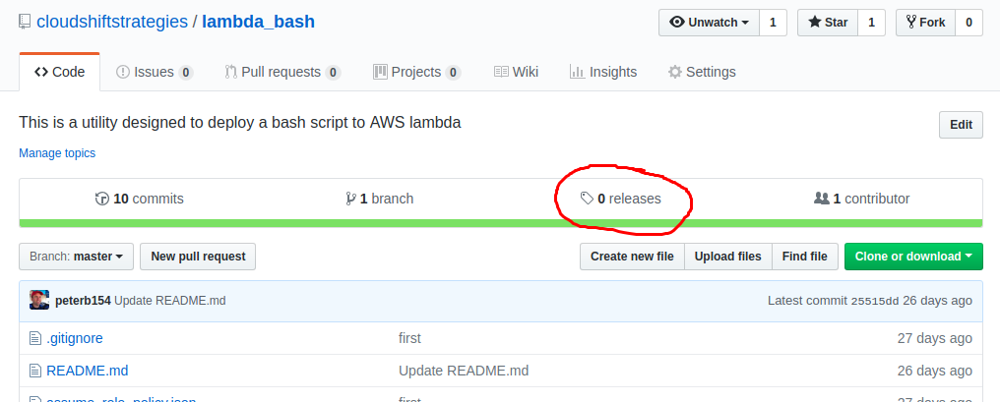
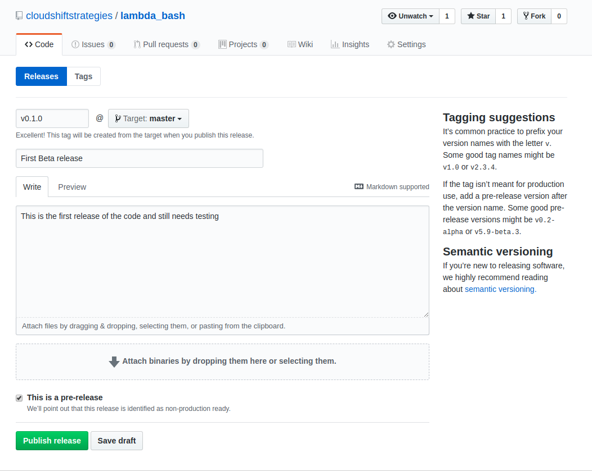
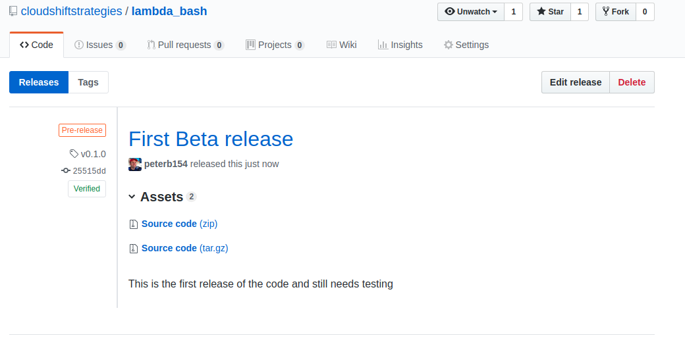
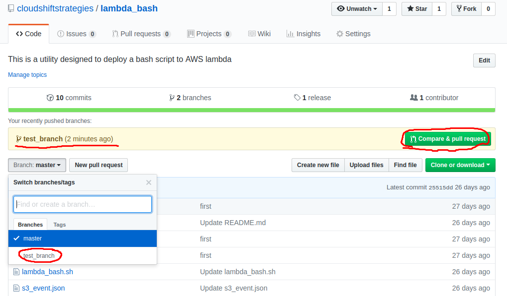
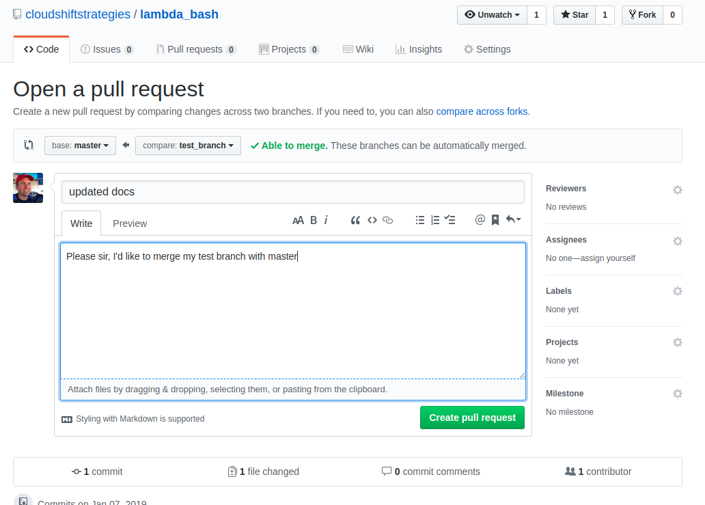
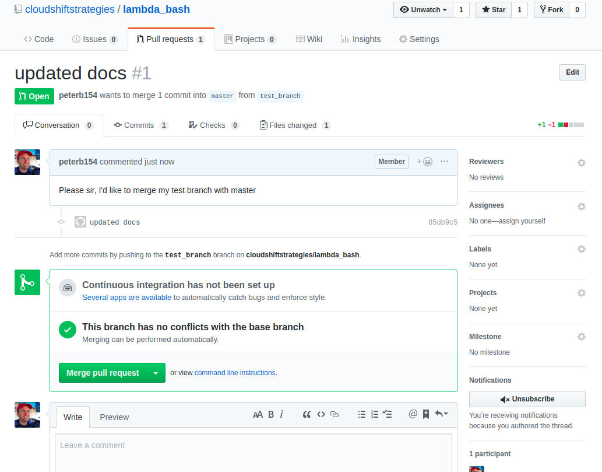
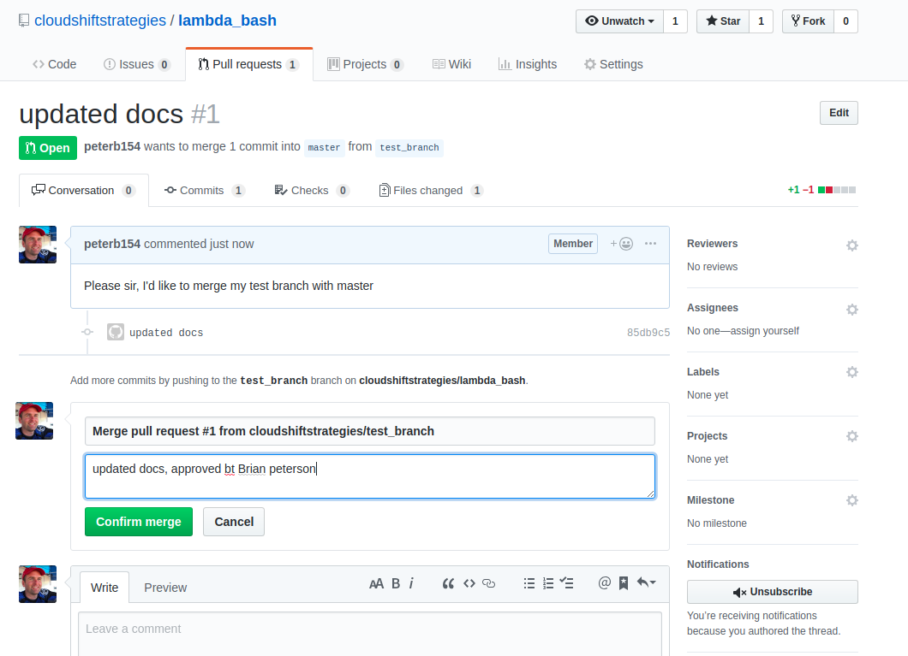
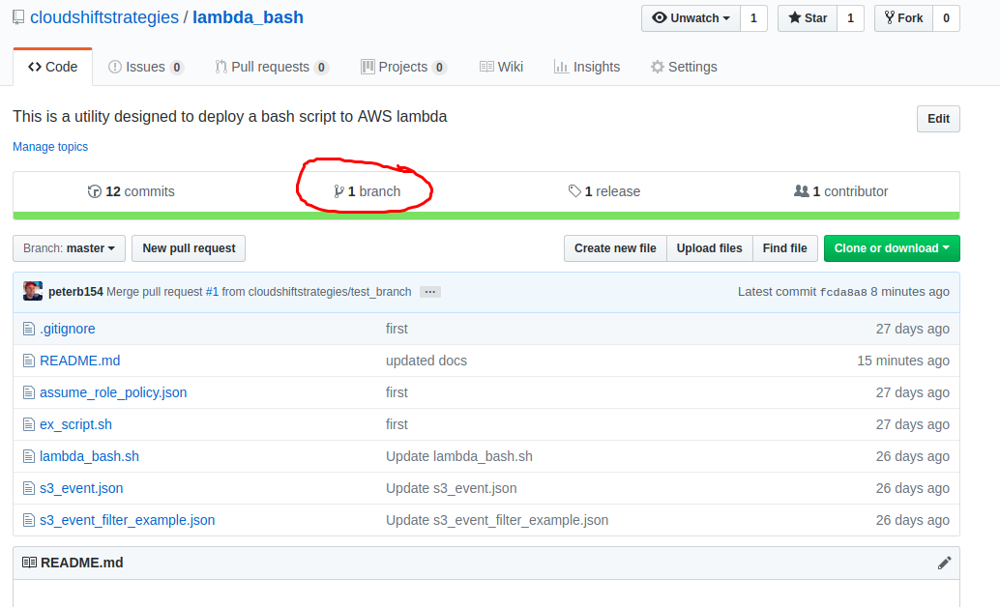

# Git / Github concepts

## What is git

Git is a version-control system for tracking changes in computer files and coordinating work on those files among
multiple people.

It is primarily used for source-code management in software development, but it can be used
to keep track of changes in any set of files. It is increasingly being used
to store infrastructure as code and documentation. The documentation you are currently reading is
stored in a git repository.

Git repositories are usually managed with the `git` command line tool which can be downloaded
[here](https://git-scm.com/downloads). There are also lots of
[git GUI tools](https://git-scm.com/downloads/guis) if you prefer. Plus, most IDEs natively
manage git repositories

## What is github

[GitHub](https://github.com) is a web-based hosting service for version control using Git. 
It offers all of the distributed version control and source code management functionality
of Git as well as adding its own features.

Github is free to store open source repositories. Github has paid plans for users and organizations
that want to store private repositories in Github.

GitHub repositories belong ether to a GitHub user, or a
[GitHub organization](https://help.github.com/articles/about-organizations/). 

Organizations are shared accounts where businesses and open-source projects can collaborate across many projects at
once. Owners and administrators can manage member access to the organization's data and
projects with sophisticated security and administrative features.

Github hosts the repository that contains the document you are reading now.

## Key git concepts

Credit to https://www.intertech.com/Blog/introduction-to-git-concepts/ for much of the content in this section


#### Repositories

A repository is a library of files stored together in a directory structure, usually representing an application
or project.

Git has two repository types: local and remote.
* The **remote repository** is typically elsewhere and for your indirect use (GitHub) and enables collaboration with teams
* The **local repository** is on your computer for only your direct use. The local repo is on your computer and has all the
   files and their commit history, enabling full diffs, history review, and committing when offline. 

#### Clone remote repositories

Use the Git clone command to create a local repo with all of the remote repo’s history.
Only use this command once to create the local repo from a remote.

`$ git clone http://username@hostname.com/giturl/gitreponame.git`

The above command creates a directory called `gitreponame` in the current working directory with all of the project files.

Now you can get to work editing files

#### Commit your work to the remote repository

After editing the files in your local repository, committing code to the remote repository is a 3 stage process

1. **Add** new / changed files to a commit

    Git only commits files from the “staged files” list, also referred to as “indexed files”. So new or updated files 
    to the local repo must be explicitly added. 
    
    To add an explicit file in the local repository run: `git add main.tf`
    
    To add all files in the local repository run: `git add .`
    
    Note: When making additional edits to a file after staging it, the staged
    file does not contain the additional edits. You have to run `git add .` again before the next step.
    
2. **Commit** Next you must commits all staged files together as an atomic commit to the local repo.

    In this stage we commit the staged files, and must provide a commit message, describing the change made
    
    `git commit -m "added a new aws instance to the main.tf file"`
    
    We can run multiple commits locally before the next step, allowing a "restore point" at each commit
    
3. **Push** In this stage, we push all staged commits to the remote repo

   `git push`
    
The full process all together
```bash
git add .
git commit -m "commit message"
git push
```

#### Use "pull" to update your local repository from remote

When you want to update your local repository with updated code in the remote repository you can use  th `git pull`
command.

Behind the scenes, git actually does a `git fetch` pulling the latest code from the remote repository and
runs a then a `git merge` none of the remote changes conflict with your local changes, git will integrate the
remote code with your local code.

```bash
git pull
```

#### Tag your code to create a release

When you apply a tag to a specific commit, you are naming the project it its current state so that we can access a
very specific version of a commit with simple references. When code is ready to be
release, software engineers tag the commit with a version number (v1.2.3) and call it a release.

Creating a release on GitHub is easy. 




Creating a release with the git cli takes a few more steps

```bash
# Clone the project from the remote repo
git clone git@github.com:cloudshiftstrategies/lambda_bash.git
cd lambda_bash

# Stage all new/updated files
git add .

# Commit all staged files
git commit -m "final fixes applies"

# Add a tag to the last commit as v0.1.0
git tag -a v0.1.0 -m "beta release"

# Push the local repo to the remote repository
git push

# Push the tags to the remote repository
git push --tags 
```

If you would like to see/use a specific release of your code locally, you can run following
```bash
# Clone the project from the remote repo
$ git clone git@github.com:cloudshiftstrategies/lambda_bash.git
$ cd lambda_bash

# see what tags are available
$ git tag
v0.1.0

# switch the local repository to a specific tag
$ git checkout tags/v0.1.0
```

Note that terraform **private modules must be tagged** with versions, so that callers of the module can rely upon
the code not changing unless the caller specifically calls for another version
```hcl
module "network-module" {
  source  = "app.terraform.io/ORG_NAME/terraform-aws-network-module"
  version = "1.4"
}
```

#### Branches and pull requests

Git repositories can have multiple branches. The main branch is usually called "master". 

When you're working on a project, you're going to have a bunch of different features or ideas in progress at any
given time – some of which are ready to go, and others which are not. Branching exists to help you manage this workflow.

When you create a branch in your project, you're creating an environment where you can try out new ideas. Changes
you make on a branch don't affect the master branch, so you're free to experiment and commit changes, safe in the
knowledge that your branch won't be merged until it's ready to be reviewed by someone you're collaborating with.

```bash
# Clone the project from the remote repo
$ git clone git@github.com:cloudshiftstrategies/lambda_bash.git
$ cd lambda_bash

# Create a new branch
$ git checkout -b test_branch
Switched to a new branch 'test_branch'

# See what branches exist and which one we are on
$ git branch
  master
* test_branch

# make changes and commit the branch
$ git add .
git commit -m "working on feature"

# Push the branch to remote. We need to explicitly specify that we want to push our test_branch
git push --set-upstream origin test_branch
```

Looking at Github, we can see the branch was created and pushed, and we even have a button to submit a pull request. 
If this is a TFE project, the pull request would trigger a speculative run


A project administrator can merge the test_branch with master, just submit the request.


An administrator of the project will get the pull request and can merge it with the master if things look good


The administrator confirms the merge


Now we can delete our test branch (if we're done using it)
```
# switch to the master branch
git checkout master

# update the master branch from the remote repo (remember it was merged with master)
git pull

# now delete the local test_branch
git branch -d test_branch

# finally push the delete to the remote branch
git push origin --delete test_branch
```

Check github, and we're back to one branch (just master)


In Terraform enterprise, remote repo commits to a new branch will not trigger runs. And when you are ready to
merge your branch back with the master, the "pull request" that you'll submit to merge your code will trigger a
[speculative plan](tfe201.md#speculative-planshttpswwwterraformiodocsenterpriserunindexhtmlspeculative-plans)
which helps to determine if the branch should be merged

#### [Github Repos & TFE workspaces structure](https://www.terraform.io/docs/enterprise/workspaces/repo-structure.html)

There are several ways to organize your TFE workspaces and github repos. Usually, each workspace has one github
repo, and the workspace is pointing to the master branch.

There are however several other ways to do this which you can read about in the
[Github Repos & TFE workspaces structure](https://www.terraform.io/docs/enterprise/workspaces/repo-structure.html)
document

[Back to Main page](../README.md)

[Next page - Day 1 Lab](../labs/lab2.md)
