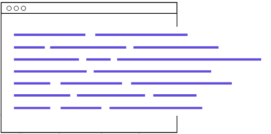
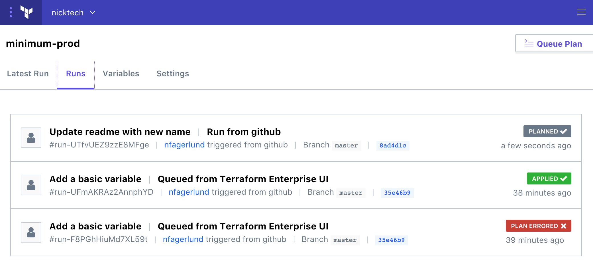

# Introduction

## 1. What is Terraform?

Terraform is a tool for **building, changing, and versioning infrastructure safely and efficiently**.

Terraform can manage existing and popular service providers as well as custom in-house solutions.

### Simple and powerful
HashiCorp Terraform enables you to safely and predictably create, change, and improve infrastructure.
* It is an open source tool that codifies APIs into declarative configuration files 
* Configurations can be shared amongst team members, treated as code, edited, reviewed, and versioned.

---


**INFRASTRUCTURE AS CODE** Define infrastructure as code to increase operator productivity and transparency.

**COLLABORATE & SHARE** Terraform configurations can be stored in version control, shared, and collaborated on by
teams of operators.

**EVOLVE YOUR INFRASTRUCTURE** Track the complete history of infrastructure versions.

**AUTOMATION FRIENDLY** If it can be codified, it can be automated.

---



**ONE SAFE WORKFLOW ACROSS PROVIDERS** Terraform provides an elegant user experience for operators to safely and
predictably make changes to infrastructure.

**MAP RESOURCE DEPENDENCIES** Understand how a minor change could have potential cascading effects across an
infrastructure before executing that change. Terraform builds a dependency graph from the configurations, and
walks this graph to generate plans, refresh state, and more. 

**SEPARATION OF PLAN & APPLY**
Separating plans and applies reduces mistakes and uncertainty at scale. Plans show operators what would happen, applies
execute changes.

**ONE SAFE WORKFLOW**
Use Terraform to create resources across all major infrastructure providers (AWS, GCP, Azure, OpenStack, VMWare, and more).

---


**REPRODUCIBLE INFRASTRUCTURE**
Terraform lets operators easily use the same configurations in multiple places to reduce mistakes and save time.

**ENVIRONMENT PARITY**
Use the same Terraform configuration to provision identical staging, QA, and production environments.

**SHAREABLE MODULES**
Common Terraform configurations can be packaged as modules and used across teams and organizations.

**COMBINE MULTIPLE PROVIDERS CONSISTENTLY**
Terraform allows you to effortlessly combine high-level system providers. Launch a server from one cloud provider, add
a DNS entry with its IP with a different provider. Built-in dependency resolution means things happen in the right order.

---


### How it works

* Configuration files describe to Terraform the components needed to run a single application or your entire data center.
* Terraform generates an execution plan describing what it will do to reach the desired state
* Then terraform executes the plan to build the described infrastructure.
* As the configuration changes, Terraform is able to determine what changed and create incremental execution plans
  which can be applied.
  
---
  
## 2. What can terraform do?

Terraform can manage low-level components such as compute instances, storage, and networking, as well as
high-level components such as DNS entries, SaaS features, etc.

   * #### Infrastructure as Code
     Infrastructure is described using a high-level configuration syntax. This allows a blueprint of your data center to be
     versioned and treated as you would any other code. Additionally, infrastructure can be shared and re-used.
     ```hcl
     resource "aws_instance" "web" {
         ami = "ami-0d8f6eb4f641ef691"
         instance_type = "t2.micro"
         security_groups = [aws_security_group.web.name]
     }
     
     resource "aws_security_group" "web" {
       name = "web-sg"
     }
     ```
     
   ---

   * #### Execution Plans
     Terraform has a "planning" step where it generates an execution plan. The execution plan shows what Terraform will
     do when you call apply. This lets you avoid any surprises when Terraform manipulates infrastructure.
     
     
   ---
   
   * #### Resource Graph
     Terraform builds a graph of all your resources, and parallelizes the creation and modification of any non-dependent
     resources. Because of this, Terraform builds infrastructure as efficiently as possible, and operators get insight
     into dependencies in their infrastructure.
     
     
   ---

   * #### Change Automation
     Complex changesets can be applied to your infrastructure with minimal human interaction. With the previously mentioned
     execution plan and resource graph, you know exactly what Terraform will change and in what order, avoiding many possible
     human errors.
     
     
   ---
     
## 3. What is HCL (Hashicorp Language)
Terraform provides a common **language** to provision infrastructure resources across multiple clouds and providers.

Example HCL template called main.tf will create an AWS virtual machine
```hcl
# main.tf
provider "aws" {
  access_key = "ACCESS_KEY_HERE"
  secret_key = "SECRET_KEY_HERE"
  region     = "us-east-2"
}

resource "aws_instance" "example" {
  ami           = "ami-050553a7784d00d21"
  instance_type = "t2.micro"
}
```

HCL is a templating language that is both easy for humans and machines to read. 

---

## 4. Workflows Matter

Terraform provides a common **workflow** to provision infrastructure resources across multiple clouds and providers.
This workflow enables change at high velocity 

   * **PLAN** - In this phase, the HCL configuration is compared against deployed resources.  The user is informed of
   the changes that will be made to the infrastructure. This is very important for understanding the impact of a change.
   
        In the following example, terraform plan reports that 1 new resource will be deployed
   
    $ terraform plan
    Refreshing Terraform state in-memory prior to plan...
    The refreshed state will be used to calculate this plan, but will not be
    persisted to local or remote state storage.

    ------------------------------------------------------------------------

    An execution plan has been generated and is shown below.
    Resource actions are indicated with the following symbols:
      + create

    Terraform will perform the following actions:

      + aws_instance.example
          id:                           <computed>
          ami:                          "ami-050553a7784d00d21"
          arn:                          <computed>
          associate_public_ip_address:  <computed>
          availability_zone:            <computed>
          cpu_core_count:               <computed>
          cpu_threads_per_core:         <computed>
          ebs_block_device.#:           <computed>
          ephemeral_block_device.#:     <computed>
          get_password_data:            "false"
          host_id:                      <computed>
          instance_state:               <computed>
          instance_type:                "t2.micro"
          ipv6_address_count:           <computed>
          ipv6_addresses.#:             <computed>
          key_name:                     <computed>
          network_interface.#:          <computed>
          network_interface_id:         <computed>
          password_data:                <computed>
          placement_group:              <computed>
          primary_network_interface_id: <computed>
          private_dns:                  <computed>
          private_ip:                   <computed>
          public_dns:                   <computed>
          public_ip:                    <computed>
          root_block_device.#:          <computed>
          security_groups.#:            <computed>
          source_dest_check:            "true"
          subnet_id:                    <computed>
          tenancy:                      <computed>
          volume_tags.%:                <computed>
          vpc_security_group_ids.#:     <computed>


    Plan: 1 to add, 0 to change, 0 to destroy.

    ------------------------------------------------------------------------

    Note: You didn't specify an "-out" parameter to save this plan, so Terraform
    can't guarantee that exactly these actions will be performed if
    "terraform apply" is subsequently run.

---
    
   * **APPLY** - In the apply phase of the workflow, terraform uses provider APIs to provision resources
   
        In the following example, the AWS virtual machine was created
   
    $ terraform apply -auto-approve
    aws_instance.example: Creating...
      ami:                          "" => "ami-050553a7784d00d21"
      arn:                          "" => "<computed>"
      associate_public_ip_address:  "" => "<computed>"
      availability_zone:            "" => "<computed>"
      cpu_core_count:               "" => "<computed>"
      cpu_threads_per_core:         "" => "<computed>"
      ebs_block_device.#:           "" => "<computed>"
      ephemeral_block_device.#:     "" => "<computed>"
      get_password_data:            "" => "false"
      host_id:                      "" => "<computed>"
      instance_state:               "" => "<computed>"
      instance_type:                "" => "t2.micro"
      ipv6_address_count:           "" => "<computed>"
      ipv6_addresses.#:             "" => "<computed>"
      key_name:                     "" => "<computed>"
      network_interface.#:          "" => "<computed>"
      network_interface_id:         "" => "<computed>"
      password_data:                "" => "<computed>"
      placement_group:              "" => "<computed>"
      primary_network_interface_id: "" => "<computed>"
      private_dns:                  "" => "<computed>"
      private_ip:                   "" => "<computed>"
      public_dns:                   "" => "<computed>"
      public_ip:                    "" => "<computed>"
      root_block_device.#:          "" => "<computed>"
      security_groups.#:            "" => "<computed>"
      source_dest_check:            "" => "true"
      subnet_id:                    "" => "<computed>"
      tenancy:                      "" => "<computed>"
      volume_tags.%:                "" => "<computed>"
      vpc_security_group_ids.#:     "" => "<computed>"
    aws_instance.example: Still creating... (10s elapsed)
    aws_instance.example: Still creating... (20s elapsed)
    aws_instance.example: Creation complete after 23s (ID: i-00eda4e6242507eee)

    Apply complete! Resources: 1 added, 0 changed, 0 destroyed.
    
---
    
   * **DESTROY** - Just as it sounds, destroy removes all resources defined
   
        In the following example, our VM is destroyed
        
    $ terraform destroy -auto-approve
    aws_instance.example: Refreshing state... (ID: i-00eda4e6242507eee)
    aws_instance.example: Destroying... (ID: i-00eda4e6242507eee)
    aws_instance.example: Still destroying... (ID: i-00eda4e6242507eee, 10s elapsed)
    aws_instance.example: Still destroying... (ID: i-00eda4e6242507eee, 20s elapsed)
    aws_instance.example: Still destroying... (ID: i-00eda4e6242507eee, 30s elapsed)
    aws_instance.example: Still destroying... (ID: i-00eda4e6242507eee, 40s elapsed)
    aws_instance.example: Destruction complete after 41s

    Destroy complete! Resources: 1 destroyed.

---

## 5. Terraform Enterprise

   * Available as a SaaS or private install
   * Terraform Enterprise provides collaboration and governance capabilities.
   * For operators, it enables collaboration on infrastructure and a central service registry to publish and discover
        infrastructure modules.
   * For organizations, it enables policy and governance to confidently provision at scale.  
   
   
   
[Back to Main page](../README.md)

[Next page - hcl101](hcl101.md)
