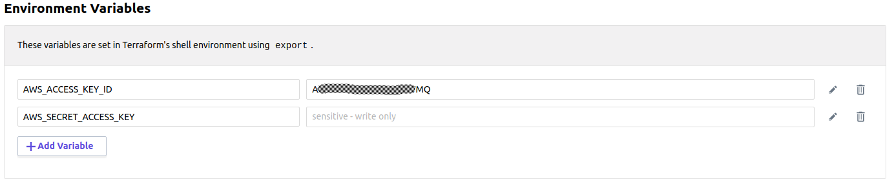

# Terraform Enterprise 101

## What is Terraform Enterprise

Terraform Enterprise (TFE) is a paid solution that extends the open source versions of terraform.

TFE makes it easier for teams to collaborate and govern Terraform changes and provides the support services
that enterprises expect and is available as a **SaaS** or **private install**

* For teams of operators, it enables collaboration on infrastructure and a central service registry to publish and discover 
infrastructure modules.
* For organizations, it enables policy and governance to confidently provision at scale. 

#### Advantages of the Private Install

1. SAML support for Single Sign on with TFE
2. TFE can access your private resources (i.e. manage a vsphere environment in your DC)
3. Customer managed, so it can meet compliance requirements such as PCI, SOC 1 & 2

# Terraform Enterprise Key Concepts

## [Version control](https://www.terraform.io/docs/enterprise/vcs/index.html)

Terraform Enterprise (TFE) is integrated it with your version control system (VCS) provider. (i.e. GitHub)

* When workspaces are linked to a VCS repository, TFE automatically initiates Terraform runs (plan & apply) when changes are 
committed to the specified branch.
* TFE makes code review easier by automatically predicting how pull requests will affect infrastructure.
* Publishing versions of a private Terraform module is as easy as pushing a tag to the module's repository.

To use configurations stored as repositories in your VCS, TFE does several things:
* Accesses a list of repositories, to let you search for repos when creating new workspaces.
* Registers webhooks with your VCS provider, to get notified of new commits to a chosen branch.
* Downloads the contents of a repository at a specific commit in order to run Terraform with that code.

* When someone adds new commits to a branch in a repository linked to TFE, any workspaces based on that branch will
  begin a Terraform run.
    * Usually a user must inspect the plan output and approve an apply
    * You can also enable automatic applies on a per-workspace basis
    * You can prevent automatic runs by locking a workspace
* When someone submits a pull request/merge request to the watched branch from another branch in the same repository, TFE
  performs a *speculative plan* with the contents of the request and links to the results on the pull request's page.
    * This helps you avoid merging PRs that cause plan failures.

## [Workspaces](https://www.terraform.io/docs/enterprise/workspaces/index.html)

Workspaces are how Terraform Enterprise (TFE) organizes your infrastructure. A workspace consists of:
* A Terraform configuration (usually retrieved from a VCS repo, but sometimes uploaded directly).
* Values for variables used by the configuration
* Persistent stored state for the resources the configuration manages
* Historical state and run logs
* Access permissions for what teams can manage the repository

#### [Workspace UI](https://www.terraform.io/docs/enterprise/workspaces/index.html#listing-and-filtering-workspaces)
* The TFE UI only includes workspaces where your user account has at least read permissions.
* If the list is large, you can use the filter tools to control what you see


#### [Workspace Planning and Organizing](https://www.terraform.io/docs/enterprise/workspaces/index.html#planning-and-organizing-workspaces)
* We recommend that organizations break down large monolithic Terraform configurations into smaller ones,
  then assign each configuration to its own workspace and delegate permissions and responsibilities for them.
* We recommend naming related TFE workspaces and VCS repositories with the same name structure.
    * A good strategy to start with is CLOUD-COMPONENT-ENVIRONMENT-REGION
        * aws-app1-prod-us-east-1
        * az-network-nonprod-cus
* Managing smaller infrastructure components is the best way to take full advantage of TFE's governance
  and delegation features.
* Example, your production environment's infrastructure might be divided into the following workspaces
  with separate teams to manage each
    * networking configuration in workspace: networking-prod
    * main application's configuration in workspace: app1-prod
    * monitoring configuration in workspace: monitoring-prod
       
  This enables teams to make changes in parallel to re-use configurations to manage other environments
  (ex. app1-dev probably has a lot of the same resources ass app1-prod)
  
#### [Workspace Runs](https://www.terraform.io/docs/enterprise/run/index.html)
Each workspace in TFE maintains its own queue of runs, and processes those runs in order.

* Whenever a new run is initiated, it's added to the end of the queue.
* If there's already a run in progress, the new run won't start until the current one has completely finished 
* Runs that are waiting for other runs to finish are in a *pending* state
* A workspace might have any number of pending runs.


TFE enforces Terraform's division between plan and apply operations.
* It always plans first, saves the plan's output, and uses that output for the apply.
* In the default configuration, it waits for user approval before running an apply,
  but you can configure workspaces to automatically apply successful plans.

#### [Workspace variables](https://www.terraform.io/docs/enterprise/workspaces/variables.html)
Terraform Enterprise (TFE) workspaces can set values for two kinds of variables:
1. **Terraform input variables** - define the parameters of a Terraform configuration.
    * TF variables set values to variables in your code in the same way that *.tfvars or -var does on the cli
    * TF variable values are strings by default. To enter list or map values, click the variable's "HCL" checkbox
2. **Shell environment variables** - required by many providers for credentials and other data.
    * You can also set environment variables that affect Terraform's behavior, like TF_LOG. 
  


* To protect sensitive variables, click the "Sensitive" checkbox next to the variable (visible when editing). 
  Marking a variable as sensitive prevents anybody (including you) from viewing its value in TFE's UI or API.
* TFE encrypts *ALL* variable values securely using [Hashicorp Vault](https://vaultproject.io/)'s transit backend
  prior to saving them. This ensures that no out-of-band party can read these values without proper authorization.
  
### Cloud Credentials
Terraform Enterprise required credentials into your cloud provider, so that it can provision infrastructure
on your behalf

* Both AWS and Azure store cloud access credentials in environment variables and require that the be set in TFE.
  See the [cloud creds](cloud_creds.md) document for detailed instructions on creating the correct cloud credentials.
* AWS requires the following 2  variables be set in each aws based TFE workspace environment variables section
    * **AWS_ACCESS_KEY_ID** 
    * **AWS_SECRET_ACCESS_KEY** (sensitive)
    
    
        For AWS accounts, it is recommended to create an IAM administrative user with administrative privileges that
        is dedicated to terraform and provide the access keys to each workspace. [cloud creds](cloud_creds.md)
* Azure requires the following 4 variables be set in each azure based TFE workspace environment variables section
    * **ARM_SUBSCRIPTION_ID**
    * **ARM_CLIENT_ID**
    * **ARM_TENANET_ID**
    * **ARM_CLIENT_SECRET** (sensitive)
    
    
        In Azure accounts, it is recommended to create a **principal account id** for terraform using the following 
        [cloud creds](cloud_creds.md) docs
    
#### [Workspace settings](https://www.terraform.io/docs/enterprise/workspaces/settings.html)

The TFE settings tab for a workspace allows certain parameters to be adjusted after workspace creation. You
can change things like
* workspace name
* whether to automatically apply runs
* the specific version of terraform that you want to use
* the working directory of your repo for the terraform project 
* workspace locks
* version control settings and VCS branch to use
* ability to destroy or delete the workspace


#### [Workspace Access control](https://www.terraform.io/docs/enterprise/workspaces/access.html)

Terraform Enterprise (TFE) workspaces can only be accessed by users with the correct permissions.
* You can manage permissions for a workspace on a per-team basis.
* When a workspace is created, the only team able to access it is the owners team, with full admin permissions.
* The special administrative team called **owners** can never be removed from a workspace.
* Teams can have one of the following
  [permissions](https://www.terraform.io/docs/enterprise/users-teams-organizations/permissions.html) in a workspace
    read (ability to see the workspace, its runs, states and configuration)
    write (all read privs + approve runs, lock workspaces & edit variables)
    admin (all write privs + delete workspace, change vcs settings & change permissions)
* A common permission model is to give engineers read access and give operations staff (or fire-ids) write access


## [Private Module Registry](https://www.terraform.io/docs/enterprise/registry/index.html)
Terraform Enterprise (TFE)'s private module registry helps you share Terraform modules across your organization.
* Support for module versioning
* a searchable and filterable list of available modules
* a [configuration designer](https://www.terraform.io/docs/enterprise/registry/design.html) to help you build new workspaces faster.
* TFE can automatically access your private modules during Terraform runs

```hcl
module "vpc" {
  source  = "app.terraform.io/example_corp/vpc/aws"
  version = "1.0.4"
}
```


* Private modules must be named with the following syntax **terraform-PROVIDER-NAME**
    * PROVIDER is the main provider where it creates that infrastructure
    * NAME reflects the type of infrastructure the module manages
    * The <NAME> segment can contain additional hyphens.
       ex: terraform-google-vault or terraform-aws-ec2-instance.
* Use [semantic](http://semver.org/) version tags (x.y.z) for releases.
   * The registry uses tags to identify module versions.
   * Release tag names can optionally be prefixed with a v (v1.2.3)
* To release a new version of a module, push a new version tag to its VCS repository.
    The registry will automatically import the new version.
    
* To access TFE modules from terraform CLI, configure a credentials block in your CLI configuration file (.terraformrc)
  with a valid [TFE API TOKEN](https://www.terraform.io/docs/enterprise/users-teams-organizations/users.html#api-tokens)

```hcl
# $HOME/.terraformrc
credentials "app.terraform.io" {
  token = "xxxxxx.atlasv1.zzzzzzzzzzzzz"
}
```


[Back to Main page](../README.md)

[Next page - tfe201](tfe201.md)