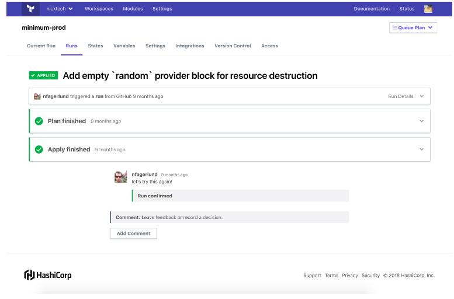

# Terraform Enterprise 201

[Speculative Plans](https://www.terraform.io/docs/enterprise/run/index.html#speculative-plans):
* Plan-only runs: they show a set of possible changes (and check them against Sentinel policies)
* Cannot be applied
* Can begin at any time without waiting for other runs
* Speculative plans do not appear in a workspace's list of runs
* You may view speculative plans with a direct link, provided when plan is initiated

How to trigger a speculative plan:
1. Create VCS pull request - TFE adds a link to the plan in the VCS provider's pull request interface.
2. Remote backend plan - running `terraform plan` using cli starts a speculative plan.
    * Results displayed in terminal and a link to the plan is provided
3. TFE runs API - whenever the specified configuration version is marked as "speculative".
    see [Create a Configuration Version](https://www.terraform.io/docs/enterprise/api/configuration-versions.html#create-a-configuration-version)
    

Interacting with runs:
* Add comment - Available any time, annotate a run
* Confirm & apply - A plan is complete and needs confirmation to be applied
* Override & continue - A soft-mandatory policy failed, apply anyway (only available for owners team).
* Discard Run - A plan is complete and needs confirmation. Click this if you do not want to apply
* Cancel Run - Stop a plan or apply currently running
* Force Cancel Run - A plan or apply was canceled, but something went wrong and TFE could not end the run gracefully
   (only available with workspace admin permissions).
   
#### [Locking workspaces](https://www.terraform.io/docs/enterprise/run/index.html#locking-workspaces-preventing-runs-)
* A lock prevents TFE from performing any plans or applies in the workspace
* Locking a workspace prevents runs within TFE, but does not prevent a user with write access from modify the
  workspace's resources by running Terraform outside TFE using the atlas remote backend and CLI
  
#### [Workspace state](https://www.terraform.io/docs/enterprise/run/index.html#terraform-state-in-tfe)
Each TFE workspace has its own separate state data automatically managed by TFE
You can view current and historical state data for a workspace from its "States" tab


#### [Cross-Workspace State Access](https://www.terraform.io/docs/enterprise/run/index.html#cross-workspace-state-access)
 * You can use a terraform_remote_state data source to access *outputs* from your other workspaces in the same organization
 * To use atlas remote states from CLI, must configure the $ATLAS_TOKEN environment variable in your shell.
    See [TFE API token](https://www.terraform.io/docs/enterprise/users-teams-organizations/users.html#api-tokens) for
    information about how to create a TFE API token

Example remote state configuration:
```hcl
# get state information from the remote workspace, which has an output "subnet_id"
data "terraform_remote_state" "vpc-workspace" {
  backend = "atlas"
  config {
    name = "TFE_ORG_NAME/TFE_WORKSPACE_NAME"
  }
}
# create an AWS instance in this workspace, referring to the subnet_id output created in another workspace
resource "aws_instance" "web" {
  # ...
  subnet_id = "${data.terraform_remote_state.vpc-workspace.subnet_id}"
}
```
