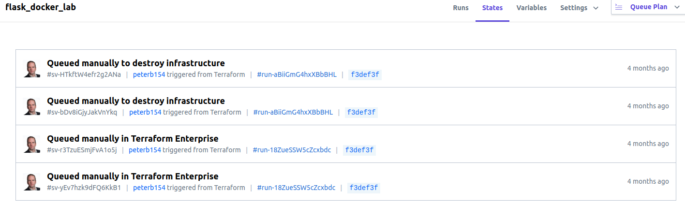

# Terraform Enterprise 201

Terraform Enterprise has some powerful features that may not be used or even known by everyone

## [Speculative Plans](https://www.terraform.io/docs/enterprise/run/index.html#speculative-plans)
These are "Plan-only" runs that show a set of possible changes (and check them against Sentinel policies)

These are very handy when working on terraform code and you want to check the syntax of the code
or see the impact of a change before you commit the code to your version control's main branch.

* Speculative Plans cannot be applied
* Speculative Plans can begin at any time without waiting for other runs
* Speculative Plans do not appear in a workspace's list of runs
* You may view speculative plans with a direct link, provided when plan is initiated

Three ways to trigger a Speculative Plan:
1. Create a VCS pull request
    * submit a PR to merge your code with the branch of a repository associated with
      a terraform workspace 
    * TFE runs a speculative plan and then adds a link to the plan in the
      VCS provider's pull request interface
    * This makes it easier for a pull request approver to see the impact of the change before it
      gets merged
    * And most importantly, it helps the submitter avoid the shame of a bunch of failed plans. :-)
2. Remote backend plan
    * Define the terraform workspace as a remote state in the config
    * Then use the TFE CLI to run `terraform plan` (readonly cloud permissions required)
    * TFE will run a speculative plan and the results are displayed in terminal with a link to the plan
3. Trigger TFE runs with API
    * whenever the specified configuration version is marked as "speculative" using API a speculative
      plan is run. See the [Create a Configuration Version](https://www.terraform.io/docs/enterprise/api/configuration-versions.html#create-a-configuration-version)
      API documentation
    
## [Run Interactions](https://www.terraform.io/docs/enterprise/run/index.html#interacting-with-runs)
On the runs page, there are several options for taking action on a run. 
* Comment - You can add a comment any time, annotate a run
* Confirm & apply - A plan is complete and needs confirmation to be applied
* Override & continue - A soft-mandatory policy failed, apply anyway (only available for owners team).
* Discard Run - A plan is complete and needs confirmation. Click this if you do not want to apply
* Cancel Run - Stop a plan or apply currently running
* Force Cancel Run - A plan or apply was canceled, but something went wrong and TFE could not end the run gracefully
   (only available with workspace admin permissions).
   
## [Locking workspaces](https://www.terraform.io/docs/enterprise/run/index.html#locking-workspaces-preventing-runs-)
You can lock a workspace 
* A lock prevents TFE from performing any plans or applies in the workspace
* Locking a workspace prevents runs within TFE, but does not prevent a user with write access from modify the
  workspace's resources by running Terraform outside TFE using the atlas remote backend and CLI
  
## [Workspace state](https://www.terraform.io/docs/enterprise/run/index.html#terraform-state-in-tfe)
Each TFE workspace has its own separate state data automatically managed by TFE
* You do not need to worry about terraform.tfstate files, or keeping your states in s3
* Terraform enterprise manages state locking to ensure concurrent runs dont conflict
* You can view current and historical state data for a workspace from its "States" tab


## [Cross-Workspace State Access](https://www.terraform.io/docs/enterprise/run/index.html#cross-workspace-state-access)
 You can use a terraform_remote_state data source to access *outputs* from your other workspaces in the same organization
 * To use atlas remote states from CLI, must configure the $ATLAS_TOKEN environment variable in your shell
   -OR- configure the terraform.rc / .terraformrc files using [these instructions](https://www.terraform.io/docs/commands/cli-config.html)
    * See [TFE API token](https://www.terraform.io/docs/enterprise/users-teams-organizations/users.html#api-tokens) for
    information about how to create a TFE API token

Example cross-workspace remote state configuration in your terraform project
```hcl
# get state information from the remote workspace that created a vpc, which has an output "subnet_id"
data "terraform_remote_state" "vpc-workspace" {
  backend = "atlas"
  config {
    name = "TFE_ORG_NAME/TFE_WORKSPACE_NAME"
  }
}
# create an AWS instance in this workspace, referring to the subnet_id output created in another workspace
resource "aws_instance" "web" {
  # ...
  subnet_id = data.terraform_remote_state.vpc-workspace.subnet_id
}
```

[Back to Main page](../README.md)

[Next page - tfe301](tfe301.md)
