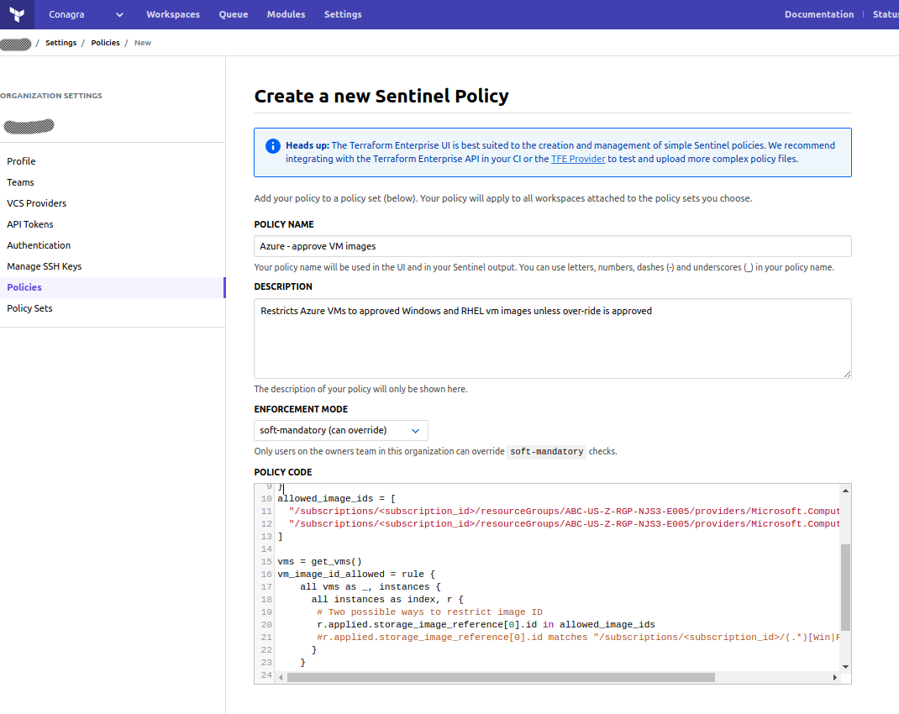
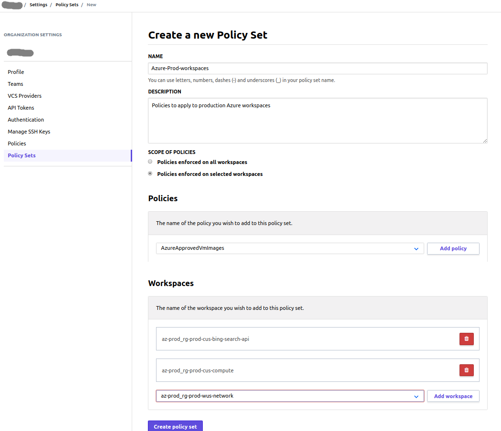

# Terraform Enterprise 301 

Terraform Enterprise has some incredibly powerful features that may be required in large enterprises

## [Sentinel Policy as code](https://www.terraform.io/docs/enterprise/sentinel/index.html)
Sentinel is an embedded policy-as-code framework integrated with the HashiCorp Enterprise products. It enables
fine-grained, logic-based policy decisions, and can be extended to use information from external sources.

* Sentinel Policies for Terraform are defined using the Sentinel policy language

Example policy that restricts the type of AWS EC2 instances that can be deployed
```
# Allowed Types
allowed_types = [
    "t2.small",
    "t2.medium",
    "t2.large",
]

# Rule to restrict instance types
instance_type_allowed = rule {
    all get_resources("aws_instance") as r {
        r.applied.instance_type in allowed_types
    }
}
```
Configuring a simple policy in TFE


Here is a great list of [sample policies](https://www.terraform.io/docs/enterprise/sentinel/examples.html)

**Policy Sets** are used to define which policies are applied to which workspaces. 

Here we are configuring a Policy Set that applies to Azure prod workspaces


* *Superuser tip*: You can use the [tfe_sentinel_policy](https://www.terraform.io/docs/providers/tfe/r/sentinel_policy.html)
  resource from the [Terraform Enterprise provider](https://www.terraform.io/docs/providers/tfe/)
  to upload and managed polices in Terraform using Terraform!

## [TFE CLI](https://github.com/hashicorp/tfe-cli/)

The tfe command line tool can upload configurations, start runs, and change and retrieve variables using the 
Terraform Enterprise API. Get it [here](https://github.com/hashicorp/tfe-cli/)

This tool is not necessary to use Terraform Enterprise's core workflows, but offers a convenient interface
for scripted actions on the command line

The tfe cli is written in POSIX Borne shell and so should be used on UNIX, Linux, and MacOS systems.
Use on Windows requires a POSIX compatible environment such as the
[Windows Subsystem for Linux (WSL)](https://docs.microsoft.com/en-us/windows/wsl/about) or
[Cygwin](https://www.cygwin.com/)

The TFE CLI can do things like: 
* tfe pushconfig — Upload a Terraform configuration to a workspace and begin a run.
* tfe pushvars — Set variables in a Terraform Enterprise workspace.
* tfe pullvars — Get variables from a Terraform Enterprise workspace and write them to stdout.
* tfe migrate — Migrate a legacy TFE environment to a new TFE workspace
* tfe workspace — Create, show, and delete workspaces

The tfe is a handy tool to populate workspace credentials via cli.

Here is an example using the tfe cli to set environment variables in a workspace
```
# push a non-senitive environment variable to a workspace
tfe pushvars -name $TFE_ORG/$TFE_WORKSPACE  -env $VAR_NAME=$VAR_VALUE -overwrite $VAR_NAME

# push a senitive environment variable to a workspace
tfe pushvars -name $TFE_ORG/$TFE_WORKSPACE -senv $VAR_NAME=$VAR_VALUE -overwrite $VAR_NAME
```

This can allow a secure process (or person) to push secured credentials to to approved workspaces without having
to share the credentials with engineers who create the workspaces (conflict of interest).

Combine tfe cli with a secrets engine like [Hashicorp Vault](https://vaultproject.io) to create a totally secure
system that doesnt require anyone to know the admin creds.
     
Or, combine terraform's
[Terraform Enterprise Provider](https://www.terraform.io/docs/providers/tfe/r/variable.html) with 
the terraform [Hashicorp Vault Provider](https://www.terraform.io/docs/providers/vault/index.html) to make a
secure and completely automated way to add credentials to workspaces, all with terraform! Cool. 

## [TFE API](https://www.terraform.io/docs/enterprise/api/index.html)

The TFE rest API allows clients of any type to make API calls to terraform. See 
[api docs](https://www.terraform.io/docs/enterprise/api/index.html) here.

Several [client libraries](https://www.terraform.io/docs/enterprise/api/index.html#client-libraries-and-tools)
have been created using these APIs, so you can use terraform enterprise in go, python and ruby scripts!

## [TFE password reset](https://github.com/cloudshiftstrategies/tfe_passwd_reset)

This tool is designed to automatically change a users password for terraform enterprise.
It is handy when the user account is actually a production control type fire-id and needs 
to be reset to an random password after use. Get the tool [here](https://github.com/cloudshiftstrategies/tfe_passwd_reset)

Example: changing joe_user's password
```bash
$ tfe_passwd.py joe_user update joes_old_pass --random
Changing password for username: joe_user at https://app.terraform.io
SUCCESS: Changed password for user: joe_user to KXZJXJC354
```

[Back to Main page](../README.md)

[Next page - TFE Lab](../labs/lab2.md)
