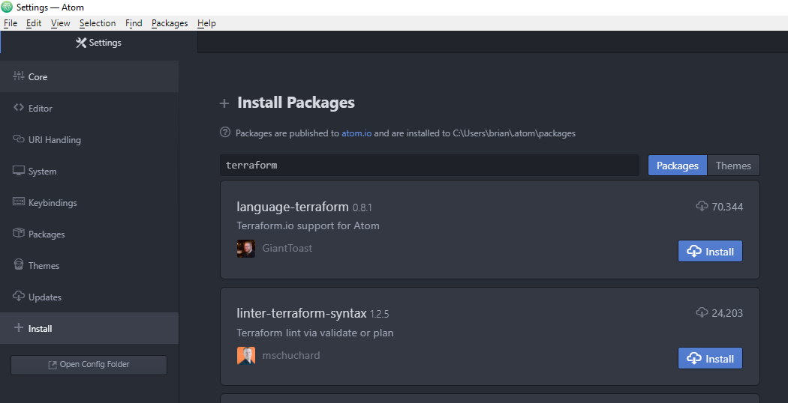
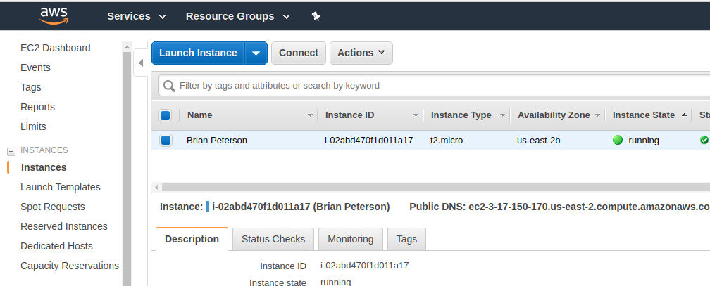

# Lab 1

0. Complete the [prerequisites](../docs/prereqs.md) to configure your environment

1. Using powershell or mac/linux terminal app, run `terraform --version` to determine the version of terraform
   installed. Ensure that terraform is in your path and the version is 0.12 or later

        $ terraform --version
        
        Terraform v0.12.05
        
2. Create a new project folder in your home directory 

        $ cd $HOME
        $ mkdir terrafrom_lab1
        
     Note, you can make this directory with whatever name in wherever location you like

3. Start the IDE you installed (instructions will be provided for Atom) and install the terraform plugin

    * Open the Atom IDE (you can close all the open windows/tabs) 
    * Go to File > Settings > +Install
    * Search for "terraform" > Install the **"language-terraform"** package
    
    * Search for "ide-terminal" > Install the **"platformio-ide-terminal"** package

    

4. Open the terraform_lab1 project folder in Atom

    * File > Open Folder
    * Select terraform_lab1 directory and click open

5. Create a new terraform file in the project folder using atom

    * Right click terraform_lab1 project directory > New File
    * Create a new file called main.tf 
    
6. Create a single output in main.tf 
    
    * Set the output name name: "first_output" with a value of "hello world"
    
    ```hcl
    # main.tf
    output "first_output" {
      value = "hello world"
    }
    ```
    
    * Be sure to save main.tf `CTRL-S` or File > Save
    * Select Platform > platformio-ide-terminal > toggle to open a terminal in the ide
    * Run `terraform apply` to see the output
    
    Your output should look like this
    
        ```
        $ terraform apply

        Apply complete! Resources: 0 added, 0 changed, 0 destroyed.

        Outputs:

        first_output = hello world

       ```
    
7. Add a variable to main.tf 
 
    * Set the variable name to "my_name" with no default value
    * Set the value of the output: "first_output" to be the value of "my_name"
    
    ```hcl
    # main.tf
    variable "my_name" {
    }

    output "first_output" {
      value = "${var.my_name}"
    }
    ```
    
    * Run `terraform apply -var my_name="YOUR_NAME"` to set the value of the variable to your name
    
    your output should look like this
    
        ```
        $ terraform apply -var my_name="Brian Peterson"
        Apply complete! Resources: 0 added, 0 changed, 0 destroyed.

        Outputs:

        first_output = Brian Peterson
        ```
        
8. Configure AWS API Credentials 
    * **Linux/Mac** 
        ```
        $ export AWS_ACCESS_KEY_ID=XXX
        $ export AWS_SECRET_ACCESS_KEY=YYY
        ```
    * **Windows Powershell**
        ```
        PS C:\> $Env:AWS_ACCESS_KEY_ID="XXX"
        PS C:\> $Env:AWS_SECRET_ACCESS_KEY="YYY"
        ```
      
    * Run an arbitrary AWS command to ensure that you are authenticated
        ```
        aws ec2 describe-instances --region=us-east-2
        ```
    
9. Add a cloud provider and aws_instance to your main.tf
    
    * Define the provider as "aws", region "us-east-2", do not specify credentials as we do not want
      to commit credentials into a github repo and they will be read from your environment variables set above
    * Define a data resource that looks up the latest ubuntu AMI
    * Define an aws ec2 vm instance of type: t2_micro and ami: ami-050553a7784d00d21" with a tag:Name = var.my_name
    * Define a single output called instance_id to be the aws instance id
    
      *hint* go to https://www.terraform.io/docs/index.html > Providers > AWS to see documentation
      
    The new complete main.tf is below
        
    ```hcl
    # main.tf
    provider "aws" {
      region = "us-east-2"
    }
 
    # Get the latest ubuntu 18.04 image owned by Canonical
    data "aws_ami" "my_ami" {
        most_recent = true
        owners = ["099720109477"]
        filter {
            name = "name"
            values = ["ubuntu/images/hvm-ssd/ubuntu-bionic-18.04-amd64-server-*"]
        }
    }

    # Deploy an instance named after me
    resource "aws_instance" "my_instance" {
      ami = data.aws_ami.my_ami.id
      instance_type = "t2.micro"
      tags = {
        Name = var.my_name
      }
    }

    # A variable with for my_name
    variable "my_name" {
    }

    # Return the aws instance id
    output "instance_id" {
      value = aws_instance.my_instance.id
    }
    ```
    
10. Run **terraform init** to download the AWS provider
 
    `terraform init`
    
    which should download the aws provider to the project's .terraform directory
    ```
    Initializing provider plugins...
    ...
    * provider.aws: version = "~> 1.54"

    Terraform has been successfully initialized!
    ...
    ```
11. Run **terraform plan** to see what will happen if we apply

    `terraform plan`
    
    Because we didnt specify the variable name on the command line, we are prompted for it
    
    ```
    $ terraform plan
    var.my_name
      Enter a value: Brian Peterson

    Refreshing Terraform state in-memory prior to plan...
    The refreshed state will be used to calculate this plan, but will not be
    persisted to local or remote state storage.


    ------------------------------------------------------------------------

    An execution plan has been generated and is shown below.
    Resource actions are indicated with the following symbols:
      + create

    Terraform will perform the following actions:

      + aws_instance.my_instance
          id:                           <computed>
          ami:                          "ami-050553a7784d00d21"
          arn:                          <computed>
          associate_public_ip_address:  <computed>
          availability_zone:            <computed>
          cpu_core_count:               <computed>
          cpu_threads_per_core:         <computed>
          ebs_block_device.#:           <computed>
          ephemeral_block_device.#:     <computed>
          get_password_data:            "false"
          host_id:                      <computed>
          instance_state:               <computed>
          instance_type:                "t2.micro"
          ipv6_address_count:           <computed>
          ipv6_addresses.#:             <computed>
          key_name:                     <computed>
          network_interface.#:          <computed>
          network_interface_id:         <computed>
          password_data:                <computed>
          placement_group:              <computed>
          primary_network_interface_id: <computed>
          private_dns:                  <computed>
          private_ip:                   <computed>
          public_dns:                   <computed>
          public_ip:                    <computed>
          root_block_device.#:          <computed>
          security_groups.#:            <computed>
          source_dest_check:            "true"
          subnet_id:                    <computed>
          tags.%:                       "1"
          tags.Name:                    "Brian Peterson"
          tenancy:                      <computed>
          volume_tags.%:                <computed>
          vpc_security_group_ids.#:     <computed>


    Plan: 1 to add, 0 to change, 0 to destroy.

    ------------------------------------------------------------------------

    Note: You didn't specify an "-out" parameter to save this plan, so Terraform
    can't guarantee that exactly these actions will be performed if
    "terraform apply" is subsequently run.
    
    ```
12. Run **terraform apply** to deploy the resources
 
    `terraform apply`
    
    Terraform will prompt you for a "yes" to make sure that you want to execute the operation.
    When complete, terraform will output the instance_id
    
    Plug the instance_id returned in output into the command below to see your instance in AWS 
    
    ```
    aws ec2 describe-instances --filters 'Name=instance-id,Values=INSERT_INSTANCE_ID_HERE'
    ```
    
    * *cli tip*: install the jq json parser to make the AWS and azure CLI's easy to parse
    
      Windows run `choco install jq` and Mac users run `brew install jq` and linux users, you know what to do
    
      ```
      aws ec2 describe-instances --filters 'Name=instance-id,Values=INSERT_INSTANCE_ID_HERE' | jq .Reservations[].Instances[].Tags`
      ```
    
    Or use AWS AWS Console > Services > EC2 > Instances
    
    
    
13. Statically set the default value to the "my_name" variable in your main.tf

    Make a change to the variable 

    ```
    variable "my_name" {
      default = "Brian Peterson, aka terraformer"
    }
    ```
    
14. Run a `terraform plan` to see what will happen

    ```hcl
    $ terraform plan
    Terraform will perform the following actions:

      ~ aws_instance.my_instance
          tags.Name: "Brian Peterson" => "Brian Peterson, aka terraformer"


    Plan: 0 to add, 1 to change, 0 to destroy.

    ```

15. Apply the change using `terraform apply -auto-approve`

    ```hcl
    $ terraform apply -auto-approve
    aws_instance.my_instance: Refreshing state... (ID: i-02abd470f1d011a17)
    aws_instance.my_instance: Modifying... (ID: i-02abd470f1d011a17)
      tags.Name: "Brian Peterson" => "Brian Peterson, aka terraformer"
    aws_instance.my_instance: Modifications complete after 3s (ID: i-02abd470f1d011a17)

    Apply complete! Resources: 0 added, 1 changed, 0 destroyed.

    Outputs:

    instance_id = i-02abd470f1d011a17

    ```

16. And check the tag value in AWS
 
   ```
    $ aws ec2 describe-instances --filters 'Name=instance-id,Values=INSERT_INSTANCE_ID_HERE' | jq .Reservations[].Instances[].Tags`
    [
      {
        "Value": "Brian Peterson, aka terraformer",
        "Key": "Name"
      }
    ]
   ``` 
   
17. Finally, destroy your resources using `terraform destroy`
 
    ```hcl
    $ terraform destroy
    aws_instance.my_instance: Refreshing state... (ID: i-02abd470f1d011a17)


    An execution plan has been generated and is shown below.
    Resource actions are indicated with the following symbols:
      - destroy

    Terraform will perform the following actions:

      - aws_instance.my_instance


    Plan: 0 to add, 0 to change, 1 to destroy.

    Do you really want to destroy all resources?
      Terraform will destroy all your managed infrastructure, as shown above.
      There is no undo. Only 'yes' will be accepted to confirm.

      Enter a value: yes

    aws_instance.my_instance: Destroying... (ID: i-02abd470f1d011a17)
    aws_instance.my_instance: Still destroying... (ID: i-02abd470f1d011a17, 10s elapsed)
    aws_instance.my_instance: Still destroying... (ID: i-02abd470f1d011a17, 20s elapsed)
    aws_instance.my_instance: Still destroying... (ID: i-02abd470f1d011a17, 30s elapsed)
    aws_instance.my_instance: Still destroying... (ID: i-02abd470f1d011a17, 40s elapsed)
    aws_instance.my_instance: Still destroying... (ID: i-02abd470f1d011a17, 50s elapsed)
    aws_instance.my_instance: Still destroying... (ID: i-02abd470f1d011a17, 1m0s elapsed)
    aws_instance.my_instance: Still destroying... (ID: i-02abd470f1d011a17, 1m10s elapsed)
    aws_instance.my_instance: Still destroying... (ID: i-02abd470f1d011a17, 1m20s elapsed)
    aws_instance.my_instance: Still destroying... (ID: i-02abd470f1d011a17, 1m30s elapsed)
    aws_instance.my_instance: Destruction complete after 1m35s

    Destroy complete! Resources: 1 destroyed.
    ```
    
 ## Day 1 Challenge (optional)
 
 This challenge will test your ability to put infrastructure as code together in more complex
 and powerful ways.
 
 Create a terraform file called main.tf that creates a number of ec2 instances each with the following parameters. 
 - AWS region is "us-east-2"
 - AWS instance ami is "ami-0d8f6eb4f641ef691"
 - AWS instance_type is "t2.micro"
 - Each ec2 instance must be tagged with "Name":"<your name>-<instance number>" where instance number is the 
   unique instance number starting from 1 (not zero). Example: "Brian Peterson-1", "Brian Peterson-2"
 - The number of instances desired must be input as a variable at runtime. Can be provided by any of the following
     - via user at runtime, prompted interactively by terraform plan/apply/destroy commands
     - via CLI -var parameter on terraform command line
     - via a .tfvars file specified by -var-file parameter on terraform command line
     - via TF_xxx environment variable
     - via a xx.auto.tfvars file
 - The project **should not allow** the user to specify more than 2 instances
 - The project should output the aws_instance private_ip of each instance created
    
 Hints and documentation:
 - Terraform AWS Provider [documentation](https://www.terraform.io/docs/providers/aws/index.html)
 - Terraform AWS Provider EC2 Instance [documentation](https://www.terraform.io/docs/providers/aws/r/instance.html)
 - Terraform input variables [documentation](https://www.terraform.io/docs/configuration/variables.html)
 - Terraform output values [documentation](https://www.terraform.io/docs/configuration/outputs.html)
 - Terraform count meta-argument [documentation](https://www.terraform.io/docs/configuration/resources.html#count-multiple-resource-instances)
 - Terraform conditional expressions [documentation](https://www.terraform.io/docs/configuration/expressions.html#conditional-expressions)
 - Terraform arithmetic operations [documentation](https://www.terraform.io/docs/configuration/expressions.html#arithmetic-and-logical-operators)
 - A working example can be found [here](lab1_terraform/main.tf)
 
 Do not forget to run `terraform destory` when compete

 
 
 
 
