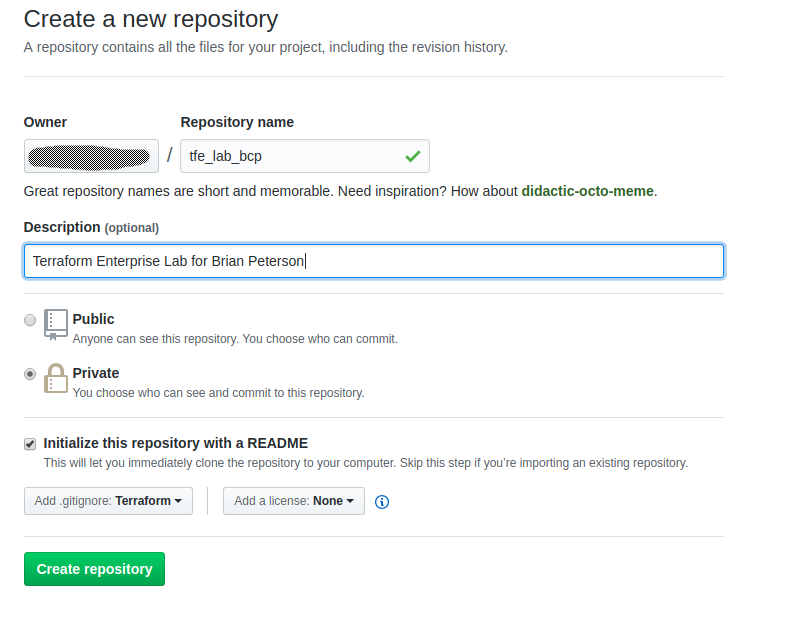
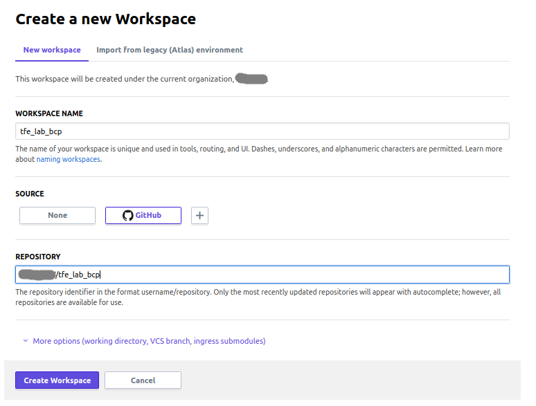
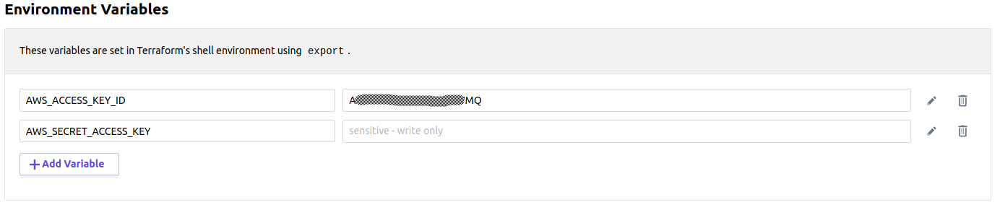
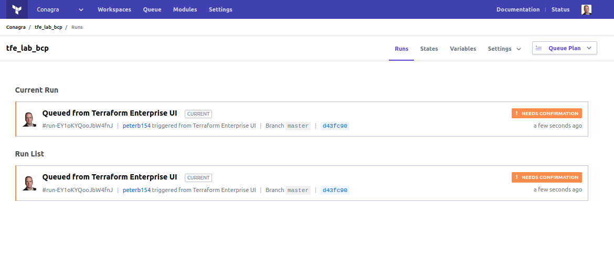
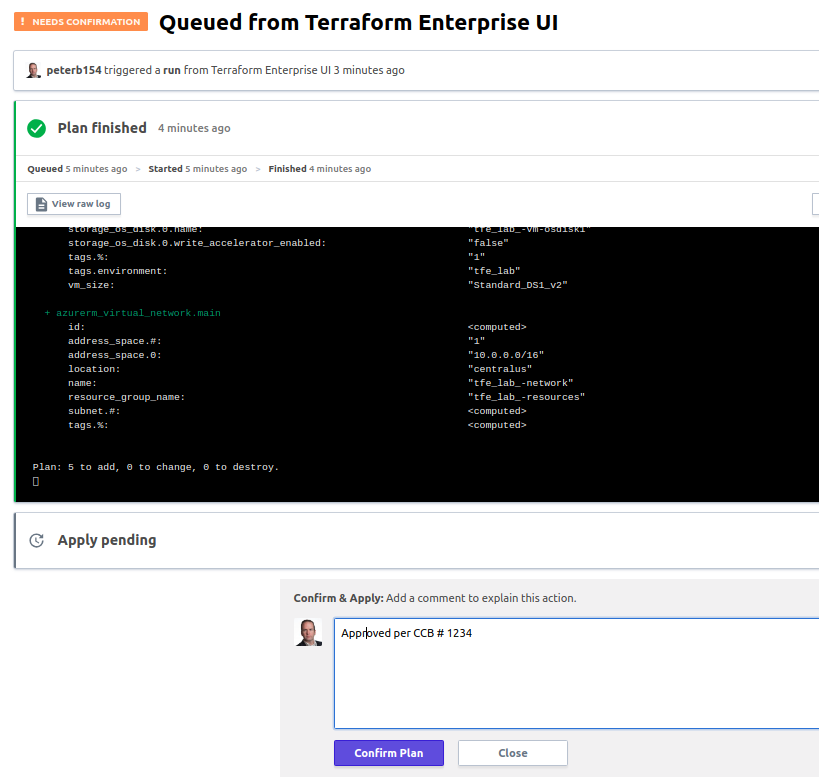
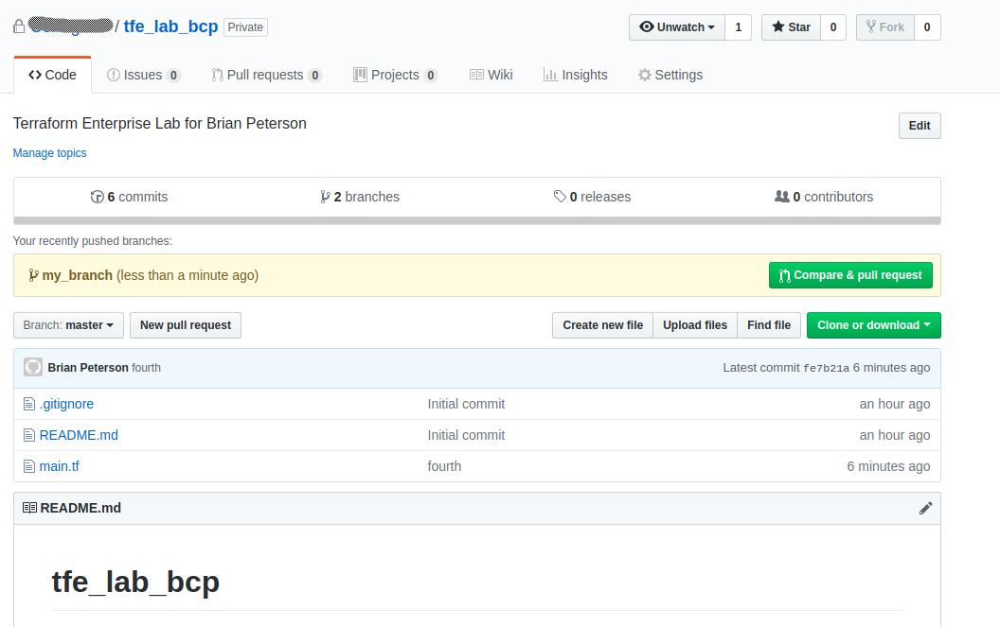
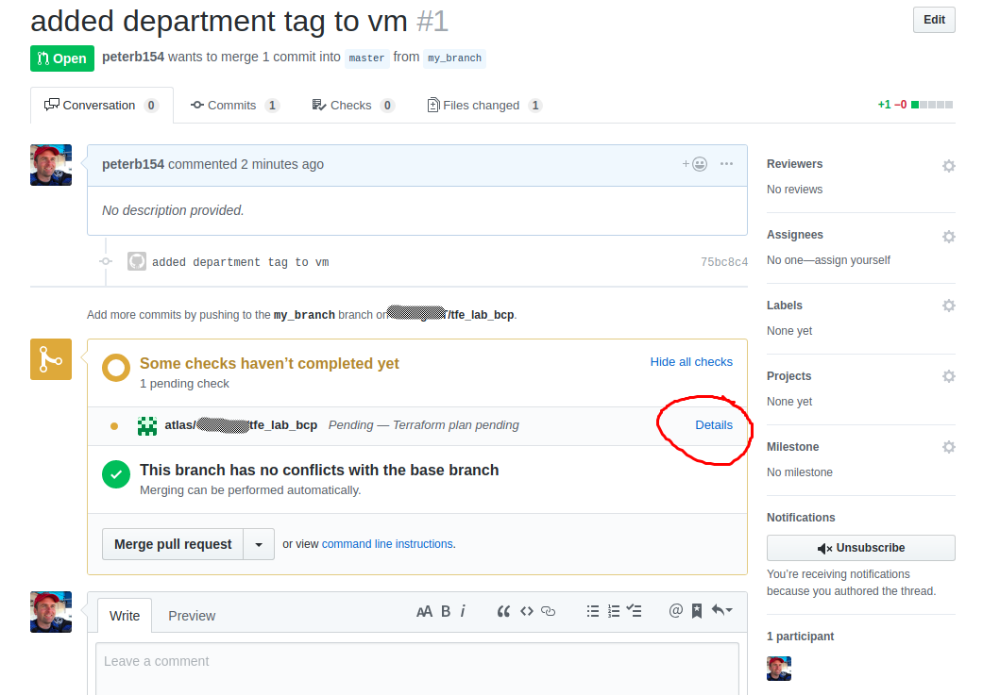
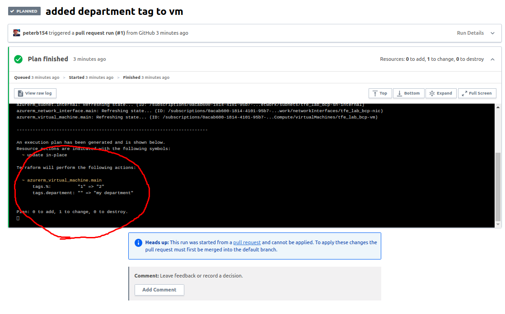
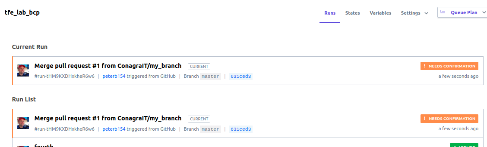

# TFE Lab

In this lab, we'll practice using Terraform Enterprise and Github

Before you start the lab, make sure that you have met the requirements defined
in [lab pre-reqs](../docs/prereqs.md) document.

## 1. Configure Github repo

#### 1.1 Validate github login

Go to https://github.com (or your company's private git repo) and confirm that you can login and access the
organization. 

#### 1.2 Create a new git repo in github or your company's private git repo

Create a new github repository named `tfe_lab_ABC` where ABC are your initials **in your company organization**


 * check Initialize this repository with a README
 * select the Terraform .gitignore template

---

## 2. Configure TFE workspace

#### 2.1  Validate TFE login

Go to https://app.terraform.io/app (or your company's private TFE install) and confirm that you can login and
see your organization

#### 2.2 Create a terraform workspace and link to repo

Create a new workspace named `tfe_lab_ABC` where ABC are your initials



#### 2.3 Configure variables to set cloud provider credentials

Workspace > tfe_lab_ABC > Variables > Environment Variables

Set the cloud provider credentials:

Aws requires:
* AWS_ACCESS_KEY_ID
* AWS_SECRET_ACCESS_KEY

Example AWS credentials set:


---

## 3. Work on your project

#### 3.1 Clone the new github repo you created
Execute the following command in the terminal to clone the repository you just created
```bash
git clone https://github.com/YOUR_ORG/tfe_lab_YOUR_INITIALS.git
cd tfe_lab_*
```

#### 3.2 Download the sample AWS terraform file and trigger a run

* Download this lab's [main_aws.tf](https://raw.githubusercontent.com/cloudshiftstrategies/css_terraform_training/master/labs/lab2_terraform/main_aws.tf)
example file to your PC, and put it in the `./tfe_lab_YOUR_INITIALS` project directory

* Use the IDE to edit the `my_name` variable in main_aws.tf and set it to your name

#### 3.3 Push the code to trigger a TFE run

```bash
git add .
git commit -m "first commit"
git push
```

#### 3.4 View the TFE plan results

Take a look at the run on https://app.terraform.io/app


#### 3.5 Apply the run

Click Confirm & Apply to apply the run


verify that the change applied successfully

---

## 4. create a branch and pull request

#### 4.1 Create a local "dev" branch of your code so that you can test changes without triggering a run

```bash
git checkout -b dev
```

Edit main_aws.tf to add a new tags to the instance
```tfe
  tags {
    Name = "${var.my_name}-${count.index + 1}"
    environment = "tfe_lab"
    department = "my department"
  }
```

Now commit the branch

```bash
git add .
git commit -m "added department tag to vm"
git push --set-upstream origin my_branch
```

#### 4.2 Create pull request to merge branch with master
Go to github and confirm that the new tag exists, and submit a pull request


#### 4.3 Look at the speculative plan created in GH

Click on the details link to be taken to the speculative plan


Notice the changes. An notice that this did not trigger a run!


Then Accept the pull request in Github

And confirm that a run started in TFE

Accept the change and apply the new tag


---

## 5. cleanup

#### 5.1 Destroy the infrastructure

in TFE, Workspaces > tfe_lab_ABC > variables > environment variables >  CONFIRM_DESTROY = 1

in TFE, Workspaces > tfe_lab_ABC > Settings > Destruction & Deletion > Queue Destroy Plan > Apply

#### 5.2 Delete the TFE workspace

in TFE, Workspaces > tfe_lab_ABC > Settings > Destruction & Deletion > Delete Workspace

#### 5.3 Delete the github repo

Github Repo > Settings > Delete this repository

#### 5.4 Delete the project in your home directory

```bash
cd $HOME
rm -rf tfe_lab_*
```

## 6. Challenge Lab
* Create a module to deploy an ec2 instance using the same [main_aws.tf](https://raw.githubusercontent.com/cloudshiftstrategies/css_terraform_training/master/labs/lab2_terraform/main_aws.tf) code used in the workspace above. Then modify your workspace code to use your provate module.
* See Private Module Publishing documentation [here](https://www.terraform.io/docs/cloud/registry/publish.html)
* See Private Module Usage documentation [here](https://www.terraform.io/docs/cloud/registry/using.html)
* Hints
  1. Modules (and thier repos) must be named with the prefix: "terraform-PROVIDER_NAME-". example module name is: "terraform-aws-ec2instance". For this lab, since multiple people will be publishing a private module, it is suggested that you name your module terrafom-aws-training-ec2-abc where abc are your initials
  2. Modules must be tagged with a 3 digit version number. example: v1.0.0. See example [here](https://github.com/cloudshiftstrategies/css_terraform_training/blob/master/docs/github.md#tag-your-code-to-create-a-release)
  3. You can use the module configuration designer to assist in configuring your workspace. See doc [here](https://www.terraform.io/docs/cloud/registry/design.html)

[Back to Main page](../README.md)

