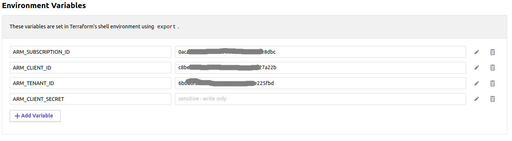
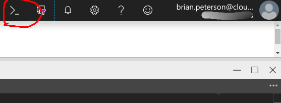
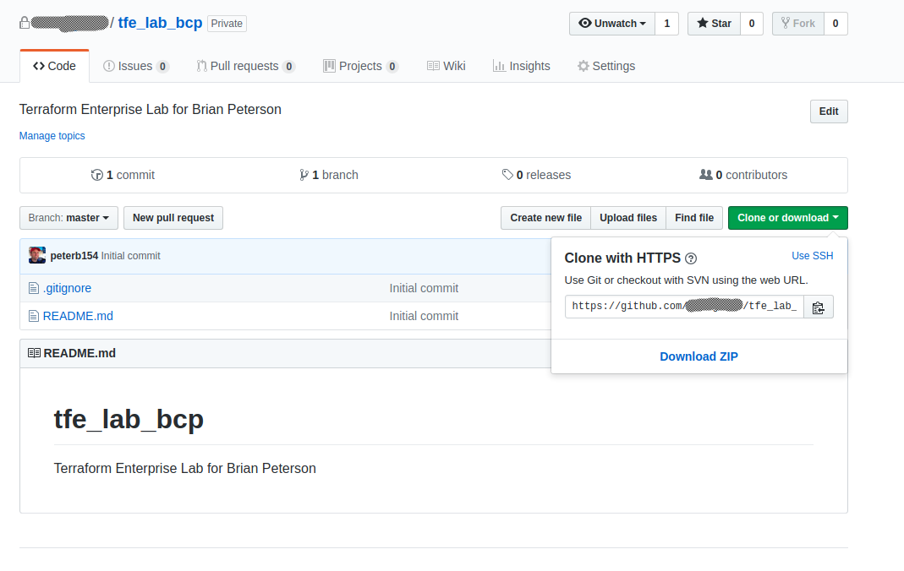
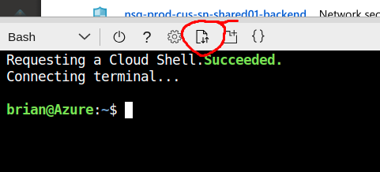
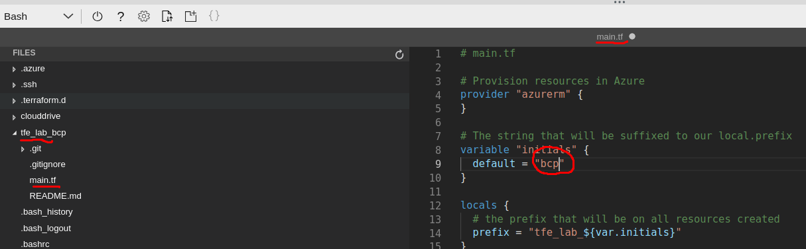

# TFE Lab

In this lab, we'll practice using Terraform Enterprise and Github

Before you start the lab, make sure that you have met the requirements defined
in [lab prereqs](../docs/prereqs.md) document.

##1. Configure Github repo

####1.1 Validate github login

Go to https://github.com confirm that you can login. 

Try accessing your company's github organization https://github.com/GH_ORG_NAME

####1.2 Create a new github repo

Create a new private repository named `tfe_lab_ABC` where ABC are your initials **in your company organization**


 * check Initialize this repository with a README
 * select the Terraform .gitignore template

##2. Configure TFE workspace

####2.1  Validate TFE login

Go to https://app.terraform.io/app and confirm that you can login and see your organization

####2.2 Create a terraform workspace and link to repo

Create a new workspace named `tfe_lab_ABC` where ABC are your initials


####2.3 Configure variables to set cloud provider credentials

Workspace > tfe_lab_ABC > Variables > Environment Variables

Set the cloud provider credentials:

Azure requires:
* ARM_SUBSCRIPTION_ID
* ARM_CLIENT_ID
* ARM_TENANET_ID
* ARM_CLIENT_SECRET (sensitive)

Example Azure credentials set:


####4. Install TFE API key

TODO: determine if we need to do this

##3. work on project

####3.1 Login to Azure portal

https://portal.azure.com/ 
and go to a **non production** subscription

Open terminal


####3.2 Clone the new github repo you created

Copy the repo http url from Github.com


Execute the following command in the Azure terminal, replacing YOUR_EMAIL, YOUR_NAME, YOUR_ORG and YOUR_INITIALS
```bash
git config --global user.email "YOUR_EMAIL"
git config --global user.name "YOUR_NAME"
git clone https://github.com/YOUR_ORG/tfe_lab_YOUR_INITIALS.git
cd tfe_lab_*
```

####3.3 Upload a terraform file and trigger a run

Download this lab's [maint.tf](https://raw.githubusercontent.com/cloudshiftstrategies/css_terraform_training/master/labs/lab2_terraform/main.tf)
sample file to your PC, then upload the file to the azure terminal



The file will be uploaded to your home directory. Copy the file to the project

```bash
cp $HOME/main.tf .
```

Use the editor to edit the initials variable



####3.4 trigger a TFE run with VCS commit/push

```bash
git add .
git commit -m "first commit"
git push
```

####3.5 view plan

Take a look at the run on https://app.terraform.io/app


####3.6 apply run

Click Confirm & Apply to apply the run


verify that the change applied successfully

##4. create a branch and pull request

####4.1 Create a local branch of your code so that you can test changes without triggering a run

```bash
git checkout -b my_branch
```

Edit main.tf to add a new tag to the vm 
```tfe
  tags {
    environment = "tfe_lab"
    department = "my department"
  }
```

Now commit the branch

```bash
git add .
git commit -m "added department tag to vm"
git push --set-upstream origin my_branch
```

####4.2 Create pull request to merge branch with master
Go to github and confirm that the new tag exists, and submit a pull request


####4.3 Look at the speculative plan created in GH

Click on the details link to be taken to the speculative plan


Notice the changes. An notice that this did not trigger a run!


Then Accept the pull regest in Github

And confirm that a run started in TFE

Accept the change and apply the new tag


##5. cleanup

####5.1 Destroy the infrastructure

in TFE, Workspaces > tfe_lab_ABC > variables > environment variables >  CONFIRM_DESTROY = 1

in TFE, Workspaces > tfe_lab_ABC > Settings > Destruction & Deletion > Queue Destroy Plan > Apply

####5.2 Delete the TFE workspace

in TFE, Workspaces > tfe_lab_ABC > Settings > Destruction & Deletion > Delete Workspace

####5.3 Delete the github repo

Github Repo > Settings > Delete this repository

####5.4 Delete the project in azure shell

```bash
cd $HOME
rm -rf tfe_lab_*
```

[Back to Main page](../README.md)
